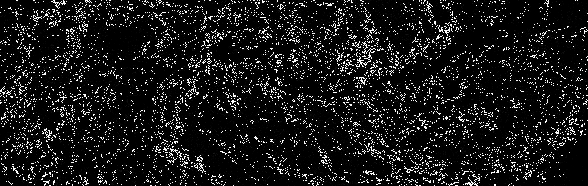

pixelsorter (+ cli) written in golang  
used my (node)js implementation as reference, which uses [satyarth/pixelsort](https://github.com/satyarth/pixelsort/) as reference  
not at parity; no sorter/comparator validation, patterns/intervals/comparators arent listed in help  
furst time using go, might be cursed  

# features
- row and spiral patterns
- sorth with a mask
- sort multiple images at once
- sort by lightness, hue, saturation, and r/g/b
- shuffle pixels, sort in waves, randomly, or do a row sort
- sort in reverse
- rotation

# wanted features
- would like to mix and match thresholds (sort by red with saturation threshold, or sort by sat with darkness threshold)
- more patterns; seam carving looks cool

# examples
**Original**  
 - [src: ESA/Webb, NASA & CSA, A. Adamo (Stockholm University) and the FEAST JWST team](https://esawebb.org/images/potm2310a/)  

**Mask**  
  

**Random sort**  
`pixelsort_go --input ~/Downloads/potm2310a.jpg --upper_threshold 0.4 --lower_threshold 0.2 --comparator saturation --angle 30 --randomness 0.4 --interval randomnoisy --output ./examples/webb-sort.jpg`


**Basic row sort w/ default options & mask**  
`pixelsort_go --input ~/Downloads/potm2310a.jpg --mask ./examples/webb-mask.jpg --output ./examples/webb-sort.jpg`
  

**Spiral sort using most options & mask**  
`pixelsort_go --input ~/Downloads/potm2310a.jpg --mask ./examples/webb-mask.jpg --pattern spiral --interval wave --randomness 0.4 --comparator saturation --section_length 400 --output ./examples/webb-spiral.jpg`
  
did you know webb and hubble pics are cc4?  

"elapsed" is time spent actually sorting  
```
=> time pixelsort_go -i ~/Downloads/potm2310a.jpg -o ./benchmark
Sorting 1 images with a config of {Pattern:row Interval:row Comparator:lightness SectionLength:60 Randomness:1 Reverse:false Thresholds:{Lower:0 Upper:1} Angle:0}.
Loading image 1 ("/home/______/Downloads/potm2310a.jpg" -> "./benchmark")...
./benchmark Elapsed: 2.084s
0:02.85 real 2.80 usermode 99% 92852 Kb mem

=> time pixelsort_go -i ~/Downloads/potm2310a.jpg -m ./examples/webb-mask.jpg -o ./benchmark
Sorting 1 images with a config of {Pattern:row Interval:row Comparator:lightness SectionLength:60 Randomness:1 Reverse:false Thresholds:{Lower:0 Upper:1} Angle:0}.
Loading image 1 ("/home/ging/Downloads/potm2310a.jpg" -> "./benchmark")...
./benchmark Elapsed: 1.137s
0:02.42 real 2.32 usermode 98% 218388 Kb mem
```
